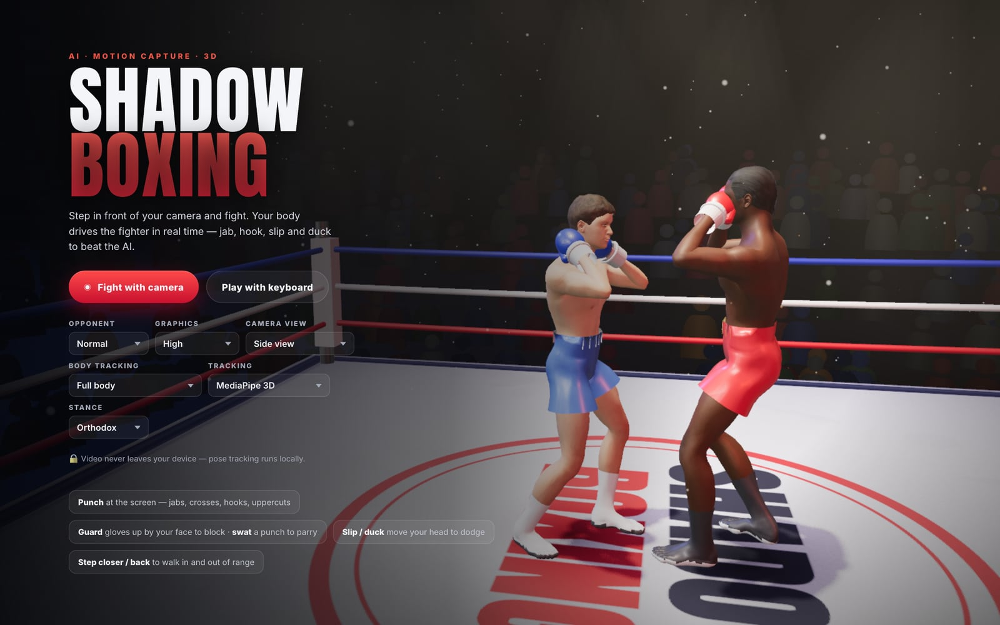
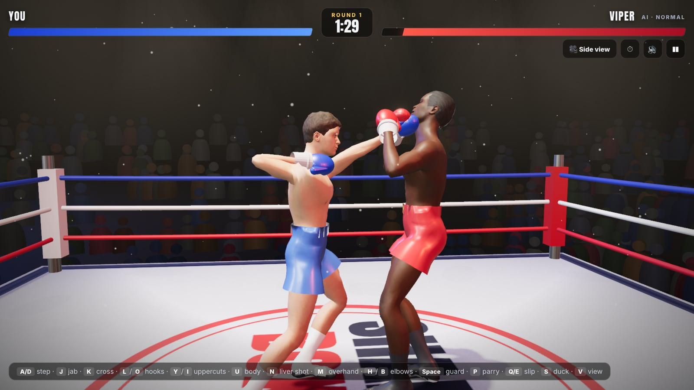
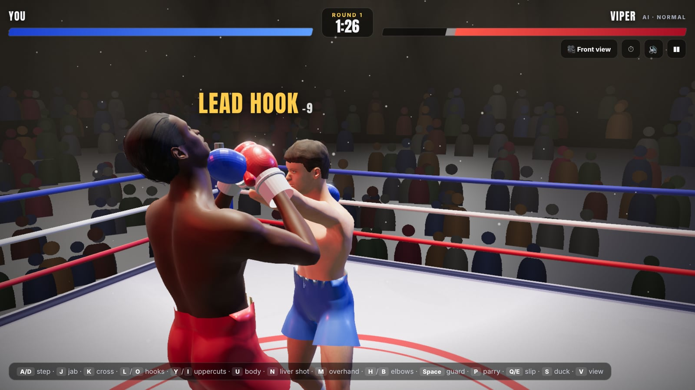
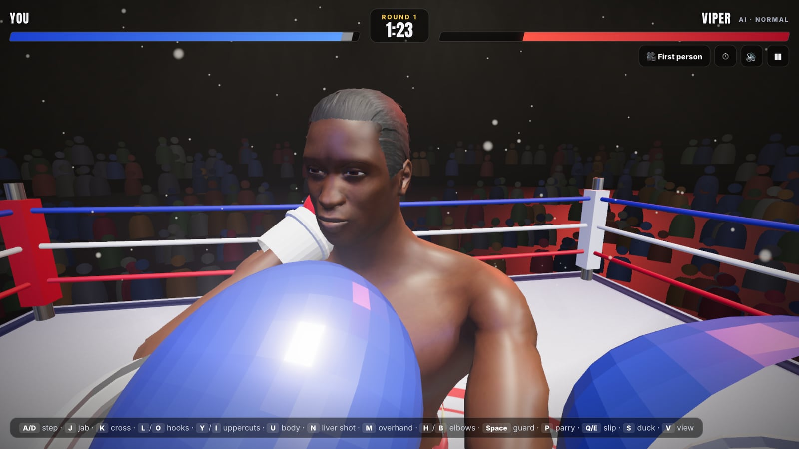
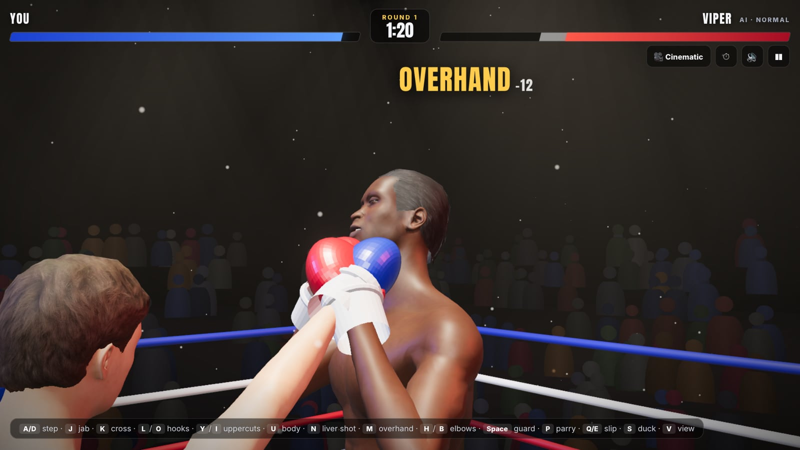
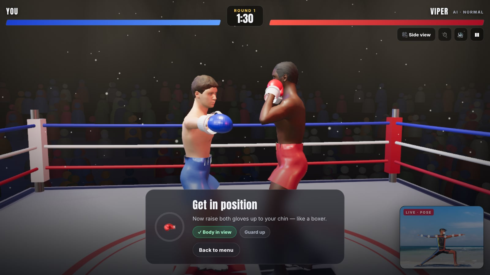
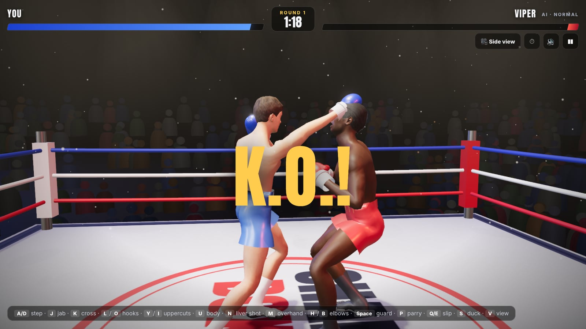

<div align="center">

# 🥊 Shadow Boxing

### Box in front of your webcam — a realistic 3D fighter copies your every move, and an AI opponent fights back.

**[▶ Play the live demo](https://cripttion.github.io/shadowboxing/)** · runs in your browser · no install · your video never leaves your device




</div>

## What it is

Shadow Boxing turns your webcam into a motion-capture rig. **Google MediaPipe**
tracks 33 points of your body in 3D, and a custom retargeting and inverse
kinematics (IK) engine drives a realistic skinned boxer in a **Three.js** arena.
You throw real punches, block, parry, slip, duck and step in and out of range
against an AI with combos, footwork and defence. Everything runs locally in the
browser at 60 FPS, including on modest laptops.

| | |
|---|---|
|  **Your cross lands:** real hit physics and head-snap reactions |  **Front view:** every punch type is labelled and scored |
|  **First person:** see the punches coming at you |  **Cinematic:** live facial expressions (pain, effort, KO, smile) |
|  **Camera tracking:** your pose drives the fighter (live skeleton preview) |  **Knockout:** slow-motion K.O. with crowd and bell |

## Features

- **Webcam motion capture:** MediaPipe Pose (3D, 33 landmarks) retargeted onto a
  52-bone skeleton. Your arms, torso and head drive the fighter 1:1.
- **Walk with your body:** step toward the camera to advance and step back to
  retreat. Lean or duck to slip punches.
- **A full boxing move set:**
  - Punches: jab, cross, lead and rear hooks, lead and rear uppercuts,
    overhand, body shot, liver shot.
  - Lead and rear elbows.
  - Defence: guard blocks, parries (which open a counter window), slips,
    ducks and pull-backs.
- **Strict punch detection:** only real, committed punches count, and twitches
  are ignored. Punches are measured relative to your chest, so turning your
  body doesn't trigger the other hand.
- **Smart AI opponent:**
  - Telegraphed combos, blocking, slipping and range management.
  - Stuns and counters.
  - Three difficulty levels.
- **Realistic characters:**
  - Two custom MakeHuman boxers with realistic skin, satin trunks and boots.
  - Eight facial expressions blended live: game face, strain, pain grimace,
    "tss" exhale, heavy breathing, blinking, KO face and winner's smile.
- **Fights as long as you like:**
  - Opponent health: Normal, Tough (3×), Iron (10×), or Endless. In Endless,
    a KO becomes a knockdown, both fighters get back up, and knockdowns are
    counted.
  - Match length: 3 × 1:30, 5 × 3:00, or no time limit.
- **Six camera views:** Side, Third person, First person, Front, Top and
  auto-cutting Cinematic (press `V`).
- **Built for low-end devices:**
  - ML inference runs in a Web Worker.
  - The best GPU/CPU backend and model are auto-tuned per device.
  - Joints are predicted ahead to compensate for latency.
  - Render resolution adapts to hold the frame rate, with three quality tiers.
- **Self-healing camera pipeline:** a watchdog recovers from lost frames,
  tracker crashes and camera disconnects.
- **No asset downloads for sound:** every sound is synthesised live with the
  Web Audio API.

## How to play

**[Open the live demo](https://cripttion.github.io/shadowboxing/)**, allow
camera access, stand back until your head and chest are in view, and raise your
guard to calibrate.

| Camera mode | |
|---|---|
| Punch at the screen | Jabs, crosses, hooks, uppercuts, overhands, body shots |
| Fist by your ear, drive the raised elbow | Elbow strike |
| Gloves up by your face | Block |
| Swat an incoming punch | Parry and counter |
| Lean / bend your knees | Slip / duck |
| Step toward / away from the camera | Walk in / out of range |
| `T` | Switch between full-body and arms-only tracking |
| `V` | Change camera view |

No webcam? Choose **Play with keyboard**:
- **Move:** `A/D` step back/in · `Q/E` slip · `S` duck
- **Punch:** `J` jab · `K` cross · `L`/`O` hooks · `Y`/`I` uppercuts ·
  `U` body · `N` liver shot · `M` overhand · `H`/`B` elbows
- **Defend:** `Space` guard · `P` parry

## How it works

```
 Webcam ─rVFC─► PoseService ──ImageBitmap (zero-copy)──► Web Worker: MediaPipe Pose (auto-tuned GPU/CPU)
                 1 frame in flight, watchdog ◄──── 3D landmarks
                      │
                      ▼
                PoseFilter ── One Euro smoothing + prediction to render time
                      │
                      ▼
                CameraDriver ── chest-frame punch detection · punch assist · walking from body size
                      │                                   AI brain / keyboard
                      ▼                                          │
                Fighter.solve ◄── BodyPose ◄──────── ProceduralBoxer (IK punches, elbows, parries)
                (twist-correct arm solver · 2-bone IK legs · planted feet · hit springs · facial morphs)
                      │
                      ▼
                Combat (swept spheres: gloves, elbows vs head/body/guard) ─► FX · audio · HUD
                      │
                      ▼
                Renderer (Three.js, adaptive resolution, quality tiers) ─► 60 FPS
```

**Latency.**
- The camera frame is grabbed the moment it arrives (`requestVideoFrameCallback`).
- Only one frame is ever in flight, and the newest frame always wins, so no
  queue builds up.
- A One Euro filter removes jitter without slowing fast punches.
- Every joint is extrapolated to the moment of rendering, so the fighter shows
  where your fist is now, not where it was when the camera saw it.

**Punch detection and assist.**
- Webcam depth is compressed: an arm pointed at the camera looks short. So
  punches are first detected from real signals (extension speed, fist travel,
  arc shape) measured in your chest's frame of reference.
- Your arm copies you 1:1 until the punch is confirmed. Then the final part of
  the punch is guided onto the target.
- The fighter turns the shoulder in, leans and steps into each punch, like a
  real boxer.

**Characters.**
- Generated with Blender and MakeHuman (`tools/character/`): body sliders, a
  low-poly muscular body, skin, hair and eyes.
- The trunks and boots are grown from the body surface, so they deform with it.
- Facial expressions are baked from MakeHuman's facial action units as morph
  targets.
- Everything is exported to optimised GLB files of about 2 MB each.

## Tech stack

| Area | Technology |
|---|---|
| Language / build | JavaScript (ES2022 modules), Vite 8 |
| 3D rendering | Three.js r186 (WebGL 2): PBR, HDRI lighting, shadows, bloom, instancing, custom GLSL shaders |
| Body tracking | Google MediaPipe Pose Landmarker (Lite/Full, 3D) via `@mediapipe/tasks-vision` (WASM + GPU/CPU); optional MoveNet Lightning via TensorFlow.js |
| Concurrency | Web Worker, `requestVideoFrameCallback`, transferable `ImageBitmap`s, watchdog recovery |
| Signal processing | One Euro filter, velocity prediction, 2D→3D lifting |
| Animation | Custom retargeting, twist-correct arm solver, analytic two-bone IK, procedural punches, spring reactions, morph-target facial expressions |
| Game logic | Swept-sphere collision, AI state machine, punch-detection state machine |
| Audio | Web Audio API (fully synthesised) |
| UI | HTML/CSS HUD, Canvas 2D camera preview |
| Characters | Blender 5.2 + MakeHuman MPFB (Python), glTF 2.0, glTF-Transform, sharp |
| Hosting | GitHub Pages via GitHub Actions |

## Run locally

```bash
npm install
npm run dev      # http://localhost:5178 (the camera needs localhost or https)
npm run build    # static site in dist/
```

Dev helpers:
- **Test without a webcam:** open `/?testsrc=/dev/pose.jpg` to run a photo
  through the full camera pipeline.
- **Punch-detection tests:** in the console, run
  `await import('/dev/punch-test.js').then(m => m.run())`. It covers nine strike
  types, a combo and eleven motions that must *not* register.
- **Live performance stats:** press `` ` `` for FPS, render scale, pose rate,
  inference time and camera→pose latency.

### Project structure

```
src/
  pose/     camera capture, worker inference, filtering (MediaPipe / MoveNet)
  avatar/   rig solver, camera driver, procedural boxer, fighter (gloves, IK legs, face)
  game/     AI opponent, combat / hit detection
  core/     renderer, quality tiers, camera views
  scene/    procedural arena, crowd, lights
  fx/ audio/ ui/
tools/character/   Blender + MakeHuman generator and GLB optimiser
public/            models, MediaPipe/MoveNet models + WASM, HDRI
```

### Regenerating the boxers

This needs Blender 5.2, the MPFB 2 extension and the MakeHuman CC0 system asset
pack.
1. Edit the presets (body sliders, skin, hair, kit colours, expressions) in
   `tools/character/gen_boxer.py`.
2. Run the build, pointing it at your Blender launcher:

```bash
BLENDER=/path/to/blender tools/character/build.sh
```

## Credits and licences

- **Fighters:** generated with [MakeHuman](http://www.makehumancommunity.org/) /
  MPFB from **CC0** assets.
- **Studio HDRI:** *Brown Photostudio 02* by [Poly Haven](https://polyhaven.com/)
  (CC0).
- **Pose tracking:** [MediaPipe Pose Landmarker](https://ai.google.dev/edge/mediapipe/solutions/vision/pose_landmarker)
  and MoveNet (Apache-2.0).
- **Rendering:** [Three.js](https://threejs.org/) (MIT).

Built by [@cripttion](https://github.com/cripttion) with Claude Code.
